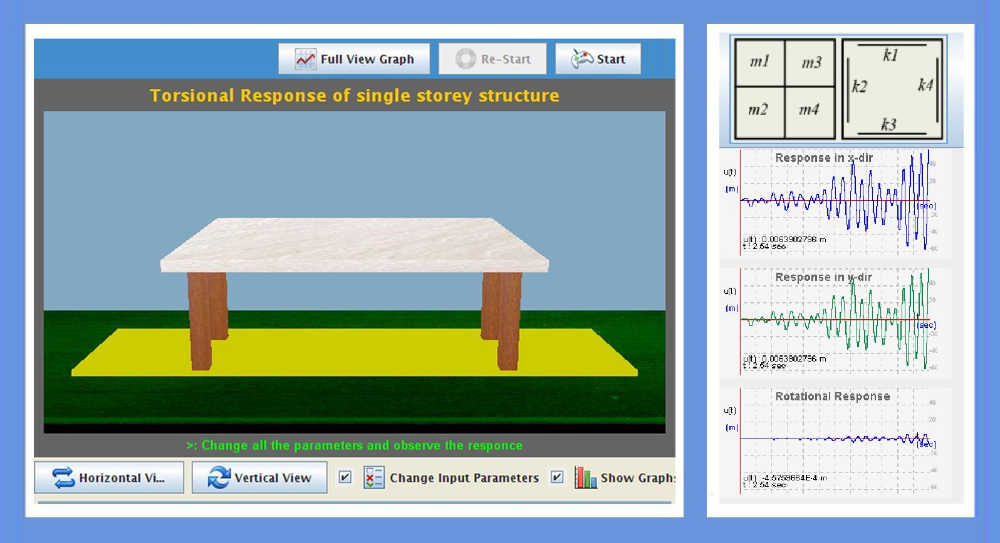

Torsional responses of building structures could be induced by structural eccentricities and by varying multiple ground excitations. Generally torsion occurs in structures which are unsymmetrical .

 To find out the responses of 3 DOF's (2 translations and 1 rotation) of a single storey structure especially torsional response along with translations.

 
